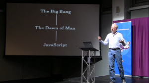

Douglas Crockford is currently giving a series of lectures on JavaScript. So far there are 2 and they are fascinating:

[http://developer.yahoo.com/yui/theater/](http://developer.yahoo.com/yui/theater/)

