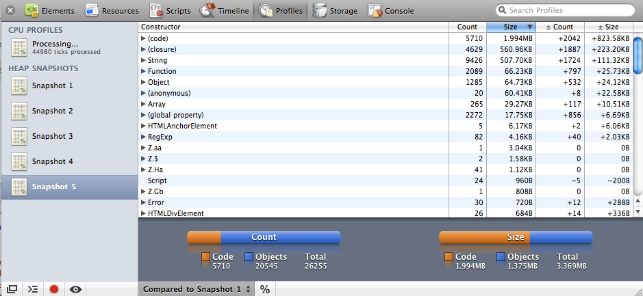
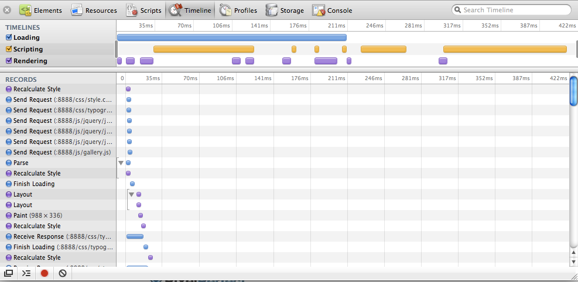
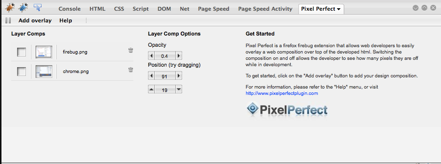

Front End debugging tools have come a long way. Below are some of the tools I am using on a daily basis to debug and fine-tune my front end code.
***
##Firebug - Firefox Plugin

<a href="http://getfirebug.com/">Firebug</a> is my workhorse for general debugging. It has the standard set of CSS inspectors and a robust net monitor. The net monitor is essential for debugging XHR requests. I could not develop Ajax applications without it.

***
##Chrome - Developer Tools

Google's chrome browser comes with an amazing set of developer tools and is quickly replacing firebug in my toolkit. It has all the standard CSS inspectors and JS debuggers but goes a bit further than firebug. I was blown away when I discovered CPU profiling. This is a great way to sniff out memory leaks, really important if you are adding/removing DOM elements like a madman.

Also important to point out are the JS timeline tools, showing you a breakdown of loading, scripting, rendering while you are interacting with the web page. Another great tool for optimizing speed.

***
##Pixel Perfect - Firefox Plugin

The ultimate tool for making sure you have translated a design to HTML with pixel perfect accuracy. <a href="http://www.pixelperfectplugin.com/">Pixel Perfect</a> allows you to overlay an image onto a web page and manipulate it's opacity. This makes it incredibly simple to compare a design mockup and your HTML.
