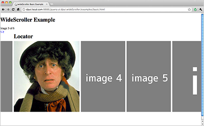
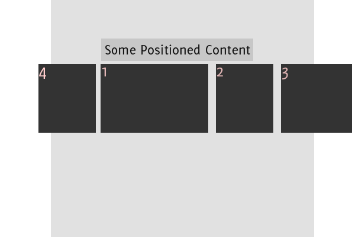
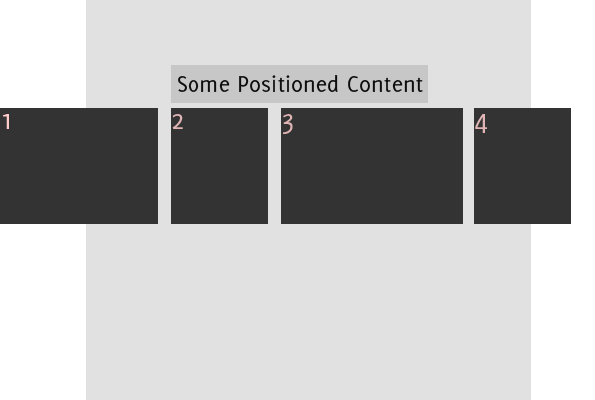

I needed a full page width image scroller that supported "infinite scrolling" and could handle being positioned, where the 1st image is aligned to something on the page. Poking around I found most jQuery scrollers made use of scrollTo and would not work when the window was the container. So I coded my own as a jQueryUI widget, this widget can be used with any HTML content.

<span class="more"></span>

##Requirements
To use wideScroller you need the following:

1. <strong><a href="https://github.com/bensternthal/jquery.ui.dpui.wideScroller">jquery.ui.dpui.wideScroller.js</a></strong> - the wide scroller widget
1. <a href="http://jquery.com/">jquery-1.5</a>
1. <a href="http://jqueryui.com/">jquery-ui-1.8.4</a> - requires widget factory, can include effect if you want fancy easing
1. <a href="http://benalman.com/projects/jquery-throttle-debounce-plugin/">jquery.ba-throttle-debounce</a> - used to throttle the window resize event


<del>You must use jquery-1.4.2 because of <a href="http://bugs.jquery.com/ticket/7193">a bug that was introduced in jQuery 1.4.3</a> and is not currently resolved. This bug will only affect you if the total width of your scrollable elements is greater than 10000px. Once this bug is resolved you should be able to update to the latest jQuery without changing any code.</del>

##Download Code
<p><a href="https://github.com/bensternthal/jquery.ui.dpui.wideScroller">Grab the source & examples from github.</a></p>

##Vew Demo
<p>
<a href="http://demo.devpatch.com/jquery.ui.dpui.wideScroller/examples/basic.html">This demo shows the basic functionality</a> - take a look before reading further as it will help explain things. Note how the "active" image is aligned with the "locator" div and how things work correctly if you resize the page.
</p>


##The HTML Template
```html
<!-- foo.html -->
<span class="ws-currentItem"></span> of
<span class="ws-totalItems"></span>

<div>
    <a href="#" class="prev"> < </a>
    <a href="#" class="next"> > </a>
</div>

<div id="scroller">

    <div id="scroller-spinner"></div>

    <div id="scroller-container">

        <div class="dpui-ws-item dpui-ws-active">
            
        </div>

        <div class="dpui-ws-item">
            
        </div>

        <div class="dpui-ws-item">
            
        </div>

        <div class="dpui-ws-item">
            
        </div>

        <div class="dpui-ws-item">
            
        </div>

        <div class="dpui-ws-item">
            
        </div>

    </div>
</div>
```

<p>Each scrollable item requires the class <strong>dpui-ws-item</strong> and the active item requires the class <strong>dpui-ws-active</strong>. Most of the other classes can be specified in the options (see below). The HTML and CSS from github is thoroughly commented.</p>


##The CSS
The opacity is just for the demo, you can use any styling you like. , For the locator, in this example its a fixed width centered div, this would likely be your top nav or something similar.

```css
body {
    padding:0;
    margin:0;
}

#scroller {
    overflow:hidden;
    position:relative;
    width:100%;
    height:525px;
}

#scroller-container {
    margin:8px 0 35px 0;
    height:480px;
    position:absolute;
    top:0px;
    left:0px;
    width:100000px;
}

.dpui-ws-item {
    position:absolute;
    padding:0 8px 0 0;
    opacity:.5;
}

.dpui-ws-active {
    opacity:1 !important;
}

#locator {
    width:980px;
    margin:0 auto 0 auto;
}

#scroller-spinner {
    position:absolute;
    width:100%;
    height:100%;
    background:#f5f5f5 url(images/spinner.gif) center center no-repeat;
    top:0px;
    left:0px;
    z-index:5;
}
```

##The JavaScript
```javascript
$(function() {
    $("#scroller").wideScroller();
});
```

##Options
wideScroller provides the following options:
<style>
    .blog-table td{
        border:1px solid silver;
        padding:3px;
    }
</style>
<table class="blog-table" style="border:1px solid silver;">
    <tr>
        <td>
            <strong>offsetLocatorID</strong>
        </td>
        <td>
            required: yes<br/>
            default value: #locator<br/>
            <i>identifies the locator, where the content will be aligned</i>
        </td>
    </tr>
    <tr>
        <td>
            <strong>containerID</strong>
        </td>
        <td>
            required: yes<br/>
            default value: #scroller-container<br/>
            <i>the container of the scrollable elements, must be different from the element the widget is invoked upon</i>
        </td>
    </tr>
    <tr>
        <td>
            <strong>loaderID</strong>
        </td>
        <td>
            required: yes<br/>
            default value: #scroller-spinner<br/>
            <i>hides the scrollable items while we re-shuffle them, see examples</i>
        </td>
    </tr>
    <tr>
        <td>
            <strong>nextButtonClass</strong>
        </td>
        <td>
            required: yes<br/>
            default value: .next<br/>
            <i>the class of the next button/link</i>
        </td>
    </tr>
    <tr>
        <td>
            <strong>prevButtonClass</strong>
        </td>
        <td>
            required: yes<br/>
            default value: .prev<br/>
            <i>the class of the prev button/link</i>
        </td>
    </tr>
    <tr>
        <td>
            <strong>showItemNumbers</strong>
        </td>
        <td>
            required: no<br/>
            default value: true<br/>
            <i>set to true if you want to display 1 of XX</i>
        </td>
    </tr>
    <tr>
        <td>
            <strong>currentItemDisplayClass</strong>
        </td>
        <td>
            required: no unless showItemNumbers is true<br/>
            default value: .ws-currentItem<br/>
            <i>if showItemNumbers is true class of current item display</i>
        </td>
    </tr>
    <tr>
        <td>
            <strong>totalItemDisplayClass</strong>
        </td>
        <td>
            required: no unless showItemNumbers is true<br/>
            default value: .ws-totalItems<br/>
            <i>if showItemNumbers is true class of total items display</i>
        </td>
    </tr>
    <tr>
        <td>
            <strong>goToItem</strong>
        </td>
        <td>
            required: no<br/>
            default value: null<br/>
            <i>used if you want to set an image other than the first as the inital image (see specify-start.html example) </i>
        </td>
    </tr>
    <tr>
        <td>
            <strong>easing</strong>
        </td>
        <td>
            required: yes<br/>
            default value: linear<br/>
            <i>the easing effect for the scroll, can use jqueryUI easing if you are including.</i>
        </td>
    </tr>
    <tr>
        <td>
            <strong>speed</strong>
        </td>
        <td>
            required: yes<br/>
            default value: 300<br/>
            <i>the speed of the scrolling, because you might be animating a large number of large images, you may need to adjust this to cut down on "tearing"</i>
        </td>
    </tr>
</table>


<br/>
##Events
The following events have callbacks that you can hook into:

<table class="blog-table">
    <tr>
        <td>
            <strong>startScroll</strong>
        </td>
        <td>
            scrolling has started
        </td>
    </tr>
    <tr>
        <td>
            <strong>stopScroll</strong>
        </td>
        <td>
            scrolling has stopped
        </td>
    </tr>
    <tr>
        <td>
            <strong>nextButtonClick</strong>
        </td>
        <td>
            next button clicked
        </td>
    </tr>
    <tr>
        <td>
            <strong>previousButtonClick</strong>
        </td>
        <td>
            previous button clicked
        </td>
    </tr>
    <tr>
        <td>
            <strong>resize</strong>
        </td>
        <td>
            window resize, (likely to be invoked numerous times)
        </td>
    </tr>
</table>

<br/>
<p>
    You can hook into a callback when the widget is instantiated or after instantiation using the standard jQuery UI Widget Interface:
</p>

```javascript
//During Instantiation
$("#scroller").wideScroller({
    startScroll: function() {
        $(".foo").hide();
    },
    stopScroll: function() {
        $(".foo").show();
    }
});

//After Instantiation Using Jquery UI Widget
("#scroller").wideScroller("option", "startScroll", function(){
    $(".foo").hide();
});
```


##Performance
<p>
If you are sliding a large number of images or if the images have very large dimensions you may notice some "tearing" in certain browsers. You can tweak both the easing and speed to find what fits best for your use-case. I have found that a faster speed (smaller in ms) makes the animation look smoother. If you are able to use > jquery.1.4.3 you can also play with <a href="http://api.jquery.com/jQuery.fx.interval/">jQuery.fx.interval</a>.
</p>

##How It Works
<p>
Some details on how the widget works, not required reading but might be useful if something is not working as expected. Note that in the illustrative images the grey area is the visible browser window.
</p>

<p>
<strong>Default State Before Widget</strong>
Before the widget loads, the page looks something like this (depending on browser). The "first" image is flush with the browser window and the rest of the images extend to the right. This initial state is not very important as the widget will move everything around.

</p>

<p>
<strong>Widget Is Loaded</strong>
When the widget loads, it  aligns the active image to the location of a user defined ID. It then re-orders the images... when it reaches one that is beyond the right edge of the window it appends those images before the active image in reverse order.
</p>



<p>
<strong>Moving Forward</strong>
Advancing through the images, all images are scrolled (using animate) the width of the next image... the next image aligns to the same location. Prior to animating we clone the first image image from the left to the right. The image is cloned so the scrolling appears smooth if the image is visible on the left and will be visible on the right during the animation (so image 4 would be visible going off the left edge and appearing to come in from the right edge). The cloned image is kept but the original is removed. Similar steps occur when moving backward.
</p>




<h2>Final Thoughts</h2>
<p>
    If you have any comments or questions, please feel free to contact me or just use the below comment form.
</p>


